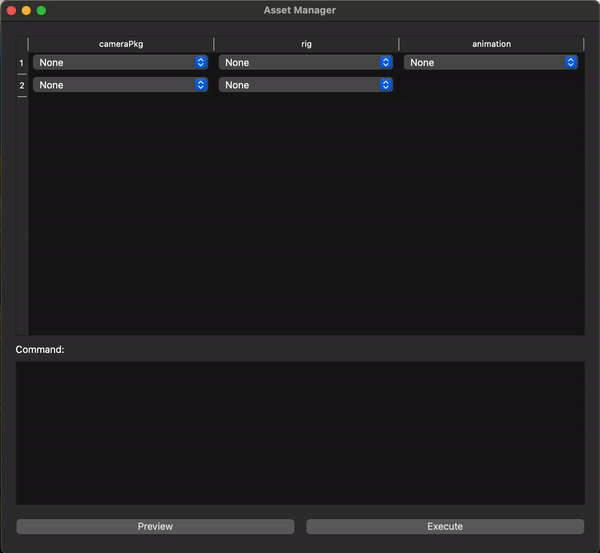

# asset-flow
A modular framework for managing asset versioning and command-driven workflows in production pipelines. This project demonstrates a decoupled architecture, separating business logic, data I/O, and UI, to simplify the development and maintenance of asset management tools.

## Key Features
- Command-Driven Workflow: Focuses on generating commands for operations (create, update, remove, still) instead of directly handling execution, ensuring scalability and flexibility.
- Decoupled Architecture: Separates business logic, data fetching/writing, and UI to enhance maintainability and testability.
- Asset Hierarchies: Supports managing complex asset relationships, such as root and child assets, in a clean and extensible way.
- Pytest-Covered Codebase: Includes unit tests to ensure robustness and reliability.

## Usage
### TrackedAsset
TrackedAsset represents an individual asset, tracking its version and associated hub set.

Example:
```python
from asset_flow import TrackedAsset

# Initialize an asset with available versions
asset = TrackedAsset(available_versions=["v1", "v2", "v3"], current_version="v1", hub_set_name="hub_set_1")

# Set a new version
asset.set_version("v2")

# Generate a command
command = asset.to_command()  # Outputs: 'update hub_set_1 from v1 to v2'
```

### AssetPackage
AssetPackage manages a collection of assets, including a root asset and its associated child assets.

Example:
```python
from asset_flow import AssetPackage, TrackedAsset

# Create a package with a root asset and child assets
assets = {
    "root_asset": TrackedAsset(available_versions=["v1", "v2"], current_version="v1", hub_set_name="hub_root"),
    "child_asset": TrackedAsset(available_versions=["v1", "v2"], current_version="v1", hub_set_name="hub_child"),
}
package = AssetPackage(root_asset_key="root_asset", assets=assets)

# Set a new version for the child asset
package.child_assets["child_asset"].set_version("v2")

# Generate commands for the package
commands = package.to_command()
# Outputs:
# [
#     "hub_root",  # Root asset hub set
#     ("child_asset", "update hub_child from v1 to v2")
# ]
```

### Command Generation
The to_command method generates one of the following commands for each asset:

- create: For new assets.
- update: For assets with changed versions.
- remove: For assets marked for removal.
- still: For assets with no changes.

# UI Integration
To demonstrate the functionality and robustness of the asset management model, a PySide6-based Asset Manager UI has been developed. This interactive graphical interface provides an intuitive way to test and visualize the asset versioning logic in real-time.



## Features
- Dynamic Asset Table:
    - Displays packages and their associated assets, including root and child assets.
    - Allows users to switch between different versions of assets using dropdown menus.
- Command Preview and Execution:
    - Preview: Generates and displays commands based on the current asset state, showcasing the command-driven workflow.
    - Execute: Simulates the application of the commands, updates the package state, and reflects changes in the UI.

## Usage
1. clone
```
git clone https://github.com/liang256/asset-flow.git
cd asset-flow
```
2. set up venv
```
python -m venv venv
source venv/bin/activate
```
3. install dependencies
```
pip install -r requirements.txt
```
4. run the app
```
python version_table.py
```
